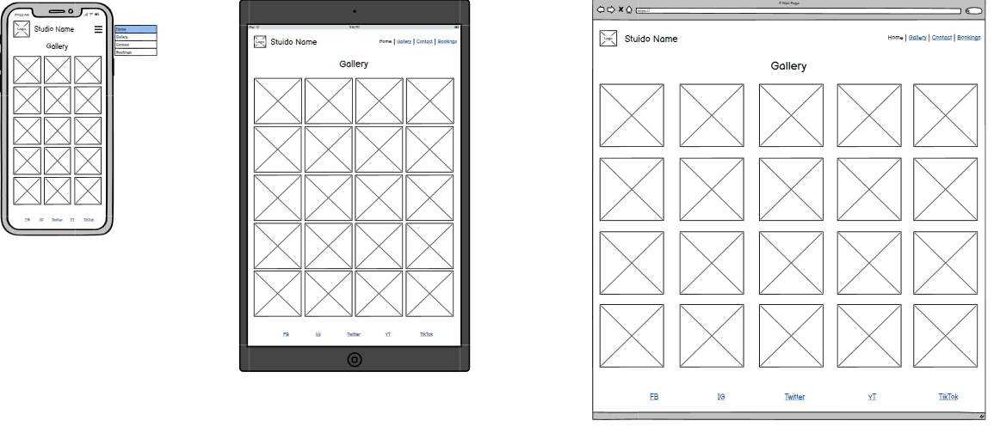
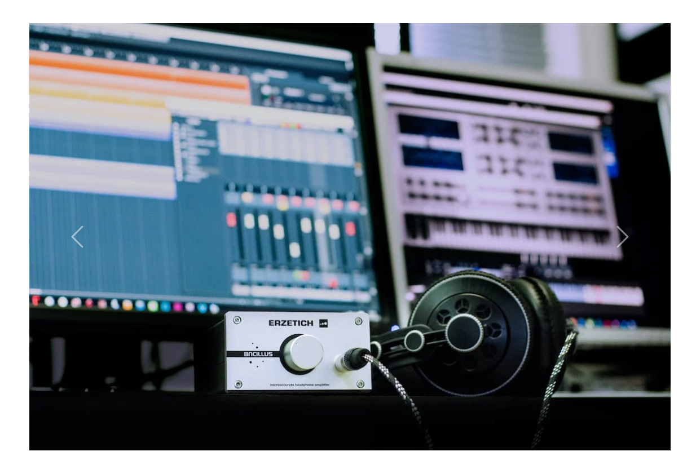

#Milestone Project 1 Welcome USER\_NAME,

In this document I will explain the purpose and meaning of the website 'Made Up Studio. The main aim of this website is to give any user information about a leading music studio in Cardiff, called Made Up Studio and also to allow them to contact the studio and make bookings where required. To facilitate this the website includes an home page with an about section (including information about the owner and the studio), a carousel gallery and a Hero image with standout text, to immediately show the user what the website is about. The main user audience for this website will be musicians and/or curious members of the public, enquiring about the studio or wanting to contact the studio to secure a booking. This website is responsive, so it can be accessed via desktop, tablet and mobile phone.

**Wireframe Images**

The last update to this file was:  2nd August 2023

**Live Website**

A live version of the project can be viewed here:

**User Experience (UX)**

**User stories (New Users, Returning Users, Frequent Users)**

The user stories are divided into three categories:

**New Users**

- As a first-time user I need to understand the purpose of the website and be given all relevant information about the studio.
- As a first-time user I need to be able to navigate the website and access all its content, making it easier to prepare for future visits to the studio and/or website.
- As a first-time user I need to be able to easily gain access, via simple links, to the company's social media accounts to keep up to date with the studio's current affairs.

**Returning users**

- As a returning user I may need to gain more information about the studio and the facilities available there.
- As a returning user I need to know I can easily make enquiries to the studio staff for more information or contact where necessary.
- As a returning user, I may want information about where the studio is located.

**Frequent users**

- As a frequent user, I may need to easily book relevant facilities, having explored the options.
- As a frequent user, I may want a simple way of accessing the company's social media, in case I appear in any photographs.
- As a frequent user, I may want access to the photographs taken by the company, especially where I feature in them.

**Design**

The design of the website is simple and functional, but also stylish and modern. The colours used in the website include different shades of grey, giving a professional and industrial theme, as well as a teal colour for hyperlinks and nav items, for which I got the idea from a colourful mixing desk, to make it feel natural to professional musicians, who are familiar with these colours.

**Features**

Navbar/Navigation: This feature gives the user the ability to navigate through the different pages of the website. The user will be made aware which page link they are hovering over, as the link will appear in teal.

Hero Image and Text: This section immediately draws the user's attention to the purpose of the website and gives them a taste of the professional nature of the business.

About Section: This provides a simple outline for relevant information about the studio's owner, the studio itself and the history.

Gallery Carousel: Provides the user with a taste of the gallery page, by automatically cycling through 10 of the main gallery photos and giving the user the option to cycle manually.

Social Links and Review Footer: This feature provides the user the ability to access the company's social media accounts to keep up to date with the latest news from the studio, as well as the ability to navigate to the company's trip advisor page to leave a review for the services.

Booking Form: This feature will give the user the ability to book a studio slot and provide their name and contact information for any relevant updates from the business, regarding their appointment.

Gallery: This will give the user a glimpse of what it is like to use the facilities and what the experience will be like. It will also showcase to them any famous talents that have used the facilities.

Contact Info Section: This section will give the user any relevant contact information, as well as the address, so they can visit with ease.

Contact Form: This feature gives the user the ability to request contact from an experienced member of the studio team for more information or assistance with a booking etc.

Map: This gives the user an idea of where the studio lies geographically, ready for their visit.

**Technologies Used**

**Languages Used**

- HTML5
- CSS

**Frameworks, Libraries & Programs Used**

- Google Fonts: I used Google Fonts to add in the main font for the website which is Lato (a few different font weights).
- Font Awesome: I used Font Awesome for the social links in the footer.
- Git: I used Git for the version control of my code.
- GitHub: I used GitHub for managing my repositories.
- Bootstrap5: I used Bootstrap5 to arrange certain elements of the site.

**Testing**

| **Test** | **Result** |
| --- | --- |
| I used the W3C Markup Validator and W3C CCS Validator Services to validate each page of the project to ensure there were no syntax errors in the project. | Results Markup Validator: all pages pass through the validator without errors and warnings.

**Testing the User Stories from User Experience (UX) section**:

**New Users**

- As a first-time user I need to understand the purpose of the website and be given all relevant information about the studio. – The hero image immediately draws your attention, assuring you immediately understand the purpose of the website.
- As a first-time user I need to be able to navigate the website and access all its content, making it easier to prepare for future visits to the studio and/or website. – The navigation bar makes it easy to navigate back and forth between pages of the site to access information.
- As a first-time user I need to be able to easily gain access, via simple links, to the company's social media accounts to keep up to date with the studio's current affairs. – The website includes a social links footer, giving users access to all the relevant social networks and even includes a link to leave a review on trust pilot and/or view previous reviews.

**Returning users**

- As a returning user I may need to gain more information about the studio and the facilities available there. – The about section immediately alerts the user to the facilities available and the services offered at the studio.
- As a returning user I need to know I can easily make enquiries to the studio staff for more information or contact where necessary. – The contact page and contact form both provide an easy way for users to contact the experienced studio staff.
- As a returning user, I may want information about where the studio is located. – The map at the bottom of the contact page, as well as the address details on the left of the page make it easy for users to locate the studio.

**Frequent users**

- As a frequent user, I may need to easily book relevant facilities, having explored the options. – The booking form makes it easy for users to book the studio where required.
- As a frequent user, I may want a simple way of accessing the company's social media, in case I appear in any photographs. – The website includes a social links footer, giving users access to all the relevant social networks and even includes a link to leave a review on trust pilot and/or view previous reviews.
- As a frequent user, I may want access to the photographs taken by the company, especially where I feature in them. – Both the gallery carousel and the gallery page, make it easy for users to view all of the studio's photographs.

**Bugs Management and Fixes**

| **Bug** | **Fix** |
| --- | --- |
| The navbar was not working on the booking page. | It turned out that the carousel buttons were raising to the top of the page and overlaying the nav, making the links of the nav unusable. I realised, by turning the background colour to black, highlighting the issue and then added the control toggles for the carousel to the same row as the carousel itself, forcing it to overlay the carousel. |
| The review link on the footer overlaid the social links in medium and smaller screen sizes. | Using bootstrap, I set the review link to disappear on medium screen sizes and below. |
| There was horizontal scroll on the contact page. | It turns out I had added gutters to the map using bootstrap, but also added margins to the section, pushing it out of the margins of the bootstrap. I corrected this by removing gutters on the bootstrap elements and adding the margin to the map itself within the div, rather than the containing div. |
| There was horizontal scroll on the contact page. | Simliarly to the contact page, I discovered that gutters were causing an issue pushing the content out of the bounds of bootstrap. Once again I removed the gutters from the bootstrap elements and added a small margin to the booking form instead. |

**Deployment**

**GitHub Pages**  The project was deployed to GitHub Pages using the following steps:

1. I pushed my final code to GIT using VS Code branch tree after finishing the project.
2. I navigated on GitHub to 'Settings'
3. After Settings I navigated to GitHub Pages
4. There I selected 'Deploy from Branch'
5. Then I selected 'Main/(root)' branch

**Credits**

**Code**

- Some of the code is based on the examples of the Love Running Project
- The code for the carousel was borrowed from the bootstrap library.

**Content**

The content was completely made up by myself.

**Media.**

- All images come from pexels.com copyright free section.

**Acknowledgements**

- I want to thank my tutors for ongoing support in my projects.
- I thank my mentor Mitko for his review and feedback on my project.
- I thank my fellow students for providing help and support via Slack.
- I thank the Code Institute for the training given, providing me with the knowledge to complete this project.

Thank you!